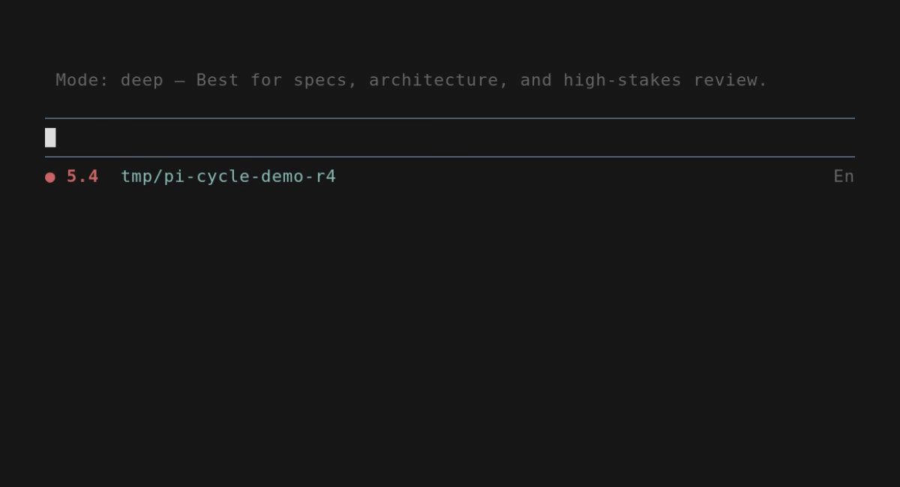

# pi-cycle

[](https://github.com/jerryfan/pi-cycle/releases)
[](https://github.com/jerryfan/pi-cycle/blob/main/LICENSE)
[](https://github.com/jerryfan/pi-cycle/actions/workflows/ci.yml)
[](https://github.com/jerryfan/pi-cycle)

One hotkey + one command to switch **work modes** in the [Pi coding agent](https://github.com/mariozechner/pi-coding-agent) by cycling **model + thinking level together**.

## Why this is worth starring

- **Mode switch is atomic:** you never end up in a mismatched “model changed but thinking didn’t” state.
- **Defaults that actually work:** prefers Pi’s `enabledModels` to avoid recommending unusable models.
- **Doesn’t get stuck:** cycles past unauthorized/unsupported models with a warning.
- **No UI clutter:** no footer/status artifacts (pairs nicely with `pi-oneliner`).
- **Self-diagnosing:** `/cycle doctor` produces a report you can paste into issues.

Quick facts:
- Hotkey: **F8** (default) → cycle next profile
- Command: **`/cycle`** → menu UI (all actions live under `/cycle ...`)
- Provider focus: **OpenAI / OpenAI Codex**
- Tested with Pi: **v0.70+**

If this helps your daily Pi loop, star the repo → it directly drives maintenance time.

---

## Demo (VHS)



This repo includes a `demo.tape` for [VHS](https://github.com/charmbracelet/vhs).

To render the GIF locally (WSL recommended):

```bash
git clone https://github.com/jerryfan/pi-cycle
cd pi-cycle
vhs demo.tape
# outputs: demo.gif
```

---

## Install

Install with **Pi**, not npm:

```bash
pi install npm:pi-cycle
```

Then in Pi:

```text
/reload
```

Project-local install (shared via `.pi/settings.json`):

```bash
pi install npm:pi-cycle -l
```

---

## Quickstart

- Open the menu: `/cycle`
- Cycle next: press `F8` (or `/cycle next`)
- Pick a specific profile: `/cycle pick`
- Configure profiles/hotkey: `/cycle config`
- Self-check: `/cycle doctor`

---

## Default OpenAI profile cycle

| Order | Profile | Model | Thinking | Good for |
|---:|---|---|---|---|
| 1 | `deep` | `openai-codex/gpt-5.5` | `xhigh` | Specs, architecture, high-stakes review |
| 2 | `code` | `openai-codex/gpt-5.3-codex` | `high` | Implementation, debugging, refactors |
| 3 | `general` | `openai-codex/gpt-5.4` | `medium` | Everyday questions + balanced deep work |
| 4 | `fast` | `openai-codex/gpt-5.4-mini` | `low` | Quick iterations and small edits |
| 5 | `value` | `openai-codex/gpt-5.2` | `medium` | Throughput / value mode |

Tip: `gpt-5.3-codex-spark` is usually best as a dedicated **spark** profile (fast coding-oriented, **no images**, smaller context) rather than your general daily mode.

---

## Commands

- `/cycle` (menu)
- `/cycle next`
- `/cycle pick` (UI required)
- `/cycle config` (UI required)
- `/cycle doctor`
- `/cycle help`
- `/cycle <name>` (direct set)

---

## Config

Config file:
- `~/.pi/agent/pi-cycle.json`

Migration note:
- `pi-cycle` will also read legacy config at `~/.pi/agent/py-cycle.json` if present.
- Any save action writes to `pi-cycle.json`.

No-UI behavior:
- If Pi is running without interactive UI, `/cycle` falls back to cycling `next`.
- `/cycle pick` and `/cycle config` require interactive UI.

### Adaptive thinking cap (optional)

`pi-cycle` can optionally **cap thinking** when the current session context window is nearly full.
This helps avoid surprises near the limit.

Configure via:
- `/cycle config` → `low-context`

Note: this uses **context window usage**, not provider billing quota.

---

## Troubleshooting

- **Installed but `/cycle` is unknown**
  - run `/reload` (or restart Pi)

- **Model activation errors** (e.g. “model not supported with this account”)
  - remove that model from the cycle via `/cycle config`
  - run `/cycle doctor` to see which profile is failing

- **Hotkey doesn’t fire**
  - some terminals don’t transmit certain key combos reliably
  - change it via `/cycle config` → `hotkey` (reload required)

---

## Development

Local dev install:

```bash
pi install -l <path-to-pi-cycle>
```

Then in Pi:

```text
/reload
/cycle
```

---

## License

MIT
